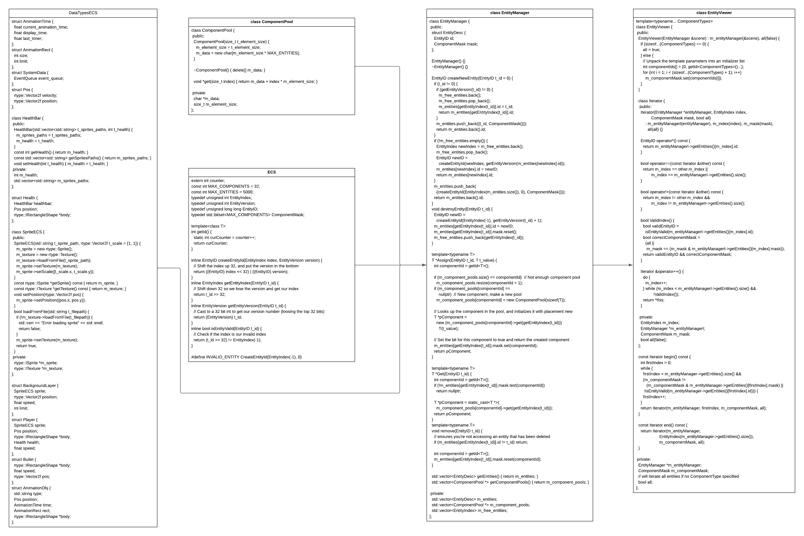

# ECS

To handle all different kind of entities in our game we decided to implement an [entity component system](https://en.wikipedia.org/wiki/Entity\_component\_system).

Below you find all components of our ecs.

<figure><figcaption></figcaption></figure>

To add a new entity you need to either add a new struct to the "DataTypesECS.hpp" or if you can reuse a struct use this. For example the coins and bullets both use the "Bullet" structure.&#x20;

In case you reuse a structure you can add the code to create the entity to the corresponding function in the "init.cpp" file. In case of a new bullet you could add a case to in the "initBulletClient()" function:

```
void initBulletClient(EntityID t_id, rtype::Vector2f t_pos,
                      std::shared_ptr<Action> t_action,
                      std::shared_ptr<EntityManager> t_em,
                      rtype::IGraphicLoader *t_graphic_loader,
                      EntityID t_owner_id) {
  EntityID bullet = t_em->createNewEntity(t_id);

  rtype::IRectangleShape *bullet_body = t_graphic_loader->loadRectangleShape();
  bullet_body->setSize({20, 20});
  bullet_body->setPosition({t_pos.x, t_pos.y});
  float speed = 10;

  switch (t_action->getShootType()) {
    case Action::ShootingType::NORMAL:
      bullet_body->setTexture(
        SpriteECS("./../Client/sprites/shoot2.png", t_graphic_loader)
          .getTexture());
      break;
    case Action::ShootingType::COIN:
      bullet_body->setTexture(
        SpriteECS("./../Client/sprites/dollarPaul.png", t_graphic_loader)
          .getTexture());
      //      speed = 6.0;
      bullet_body->setSize({40, 25});
      break;
    case Action::ShootingType::FIRE:
      bullet_body->setTexture(
        SpriteECS("./../Client/sprites/shoot3.png", t_graphic_loader)
          .getTexture());
      break;
    case Action::ShootingType::BOMB:
      bullet_body->setTexture(
        SpriteECS("./../Client/sprites/shoot4.png", t_graphic_loader)
          .getTexture());
      break;
    case Action::ShootingType::SPECIAL: //example
     bullet_body->setTexture(
        SpriteECS("./../Client/sprites/special.png", t_graphic_loader)
          .getTexture());
      break;
  }
  std::cout << "create bullet for player " << std::to_string(t_owner_id)
            << std::endl;
  Bullet displayable_bullet = {bullet_body, speed, t_pos, t_owner_id,
                               static_cast<float>(t_action->getShootDamage())};
  t_em->Assign<Bullet>(bullet, displayable_bullet);
}
```

Important is if you add a new entity you must update the actions. In case of the "SPECIAL"-bullet we need to add "SPECIAL" to the "ShootingType" enumeration.

To add new or  edit existing actions, you need to edit "Action.hpp", "Action.cpp" and either create a new "{Name}Action" file or edit the corresponding file

{Name}Action.hpp:

```
#ifndef R_TYPE_CLIENT_{Name}ACTION_HPP
#define R_TYPE_CLIENT_{Name}ACTION_HPP

#include <string>

#include "Action.hpp"

class {Name}Action : public Action {
 public:
  {Name}Action(); // add your arguments

  ~{Name}Action() = default;
};
```

{Name}Action.cpp:

```
#include "./{Name}Action.hpp"

{Name}Action::{Name}Action(EntityID t_id, std::string t_lobby_ip,
                                     std::string t_player_name)
    : Action(ActionType::CREATELOBBY, t_id) {
  m_player_name = t_player_name;
  m_lobby_ip = t_lobby_ip;
}
```

[Back](../overview/game-engine.md)
