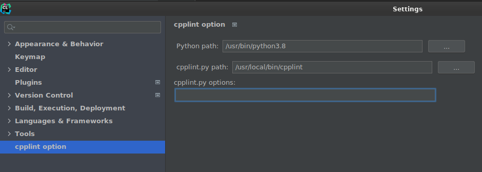

# Linter and Formatter

For this project, we are using cpplint as a Linter and clang-format for the formatting. Here you can find steps to install both.

## cpplint 

#### Clion 

1. pip install cpplint
2. File → Settings → Plugins → install “Clion-cpplint” and press apply
3. File → Settings → cpplint option → insert your python and cpplint path
   1.

       <figure><figcaption></figcaption></figure>

#### Vscode 

1. pip install cpplint
2. Extensions → install “cpplint”

## clang-format 

#### Clion 

1. In case the .clang-format file is not automatically detected:
   1. File → Setttings → Code Style → tick “Enable ClangFormat”
2. File → Settings → Version Control → Commit → Before Commit → Enable “Reformat code”

#### Vscode 

1. File → Preferences → Settings → search for “format” → enable “Editor: Format on Save”

[Back](../../README.md)
